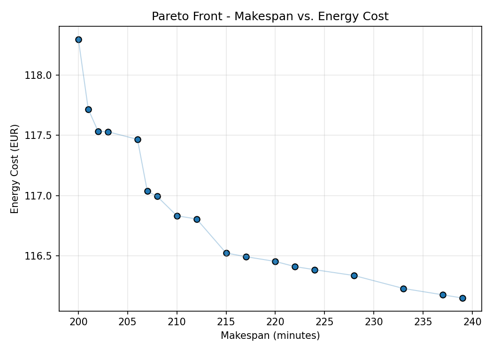
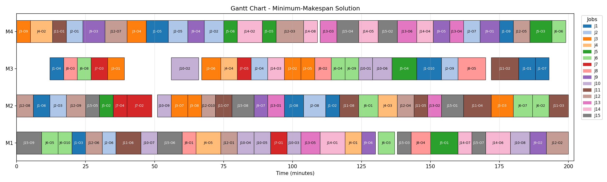

# Energy-Aware Flexible Job-Shop Scheduling via a Memetic NSGA-II

A bi-objective optimisation mini project that schedules operations on a
Flexible Job-Shop Scheduling Problem (FJSP) instance to jointly minimise:

1. **Makespan** — total time to complete all jobs.
2. **Energy cost** — a real-time (hourly) electricity price signal (Belgium
   day-ahead market, February 2022, source: ENTSO-E Transparency Platform)
   integrated over each operation's processing window.

Using a real, time-varying electricity price instead of a flat per-machine
energy rate lets the optimiser genuinely trade off "finish faster" against
"run machines when electricity is cheap" — the demand-response scheduling
problem manufacturers face as energy grids shift toward intermittent,
price-volatile renewable generation.

## Background and motivation

This project is a small-scale, educational implementation inspired by the
energy-cost-aware FJSP formulation and solution approach described in
Burmeister, Guericke, and Schryen (2024) [1]. That paper motivates the
problem from the manufacturing side of demand response: as electricity
grids incorporate more intermittent renewable generation, energy prices
increasingly fluctuate at short (e.g., hourly) intervals under real-time
pricing (RTP) tariffs, and manufacturers who can shift flexible production
to cheap-price windows reduce cost without new capital investment. The
paper's central methodological contribution is a **memetic NSGA-II** — the
population-based multi-objective genetic algorithm NSGA-II (Deb et al.,
2002) [2], hybridised with a local-search refinement step in the sense
introduced by Moscato and Cotta (2003) [3] — that approximates the
makespan/energy-cost Pareto front for FJSP instances under dynamic RTP
tariffs, validated against an exact Gurobi solver on the Brandimarte (1993)
[4] benchmark instances (mk01–mk15).

This repository follows the same conceptual outline — NSGA-II augmented
with greedy local search, minimising (makespan, energy cost) under a real
RTP-style price series — implemented independently in Python with
[pymoo](https://pymoo.org/) as a compact, reproducible demonstration rather
than a reproduction of the paper's full experimental study. See
[Differences from Burmeister et al. (2024)](#differences-from-burmeister-et-al-2024)
below for what is simplified.

## Method

- **Problem representation**: each operation is assigned a machine (from
  its eligible set) and a sequencing key; operations execute in ascending
  order of sequencing key, subject to machine and job-precedence
  availability.
- **Algorithm**: NSGA-II [2] via pymoo, augmented with a greedy local
  search ("memetic" [3]) step applied to every offspring each generation —
  alternately trying machine re-assignments and sequencing-key swaps,
  keeping any move that Pareto-dominates the current solution.
- **Data**: `belgium_prices_feb2022.csv`, preprocessed from the raw
  ENTSO-E day-ahead price export (`belgium_prices_feb2022_raw.csv`) [5] by
  `parsing_data.py` into a clean `(timestamp, price_eur_per_kWh)` series,
  then resampled to per-minute resolution so energy cost can be integrated
  exactly over each operation's start/end window.

## Files

| File | Purpose |
|---|---|
| `nsga2_fjsp_energy.py` | Main script: problem definition, NSGA-II + local search, plotting |
| `parsing_data.py` | One-off preprocessing of the raw ENTSO-E price export |
| `belgium_prices_feb2022_raw.csv` | Raw ENTSO-E day-ahead prices (EUR/MWh) |
| `belgium_prices_feb2022.csv` | Cleaned prices (EUR/kWh, parsed timestamps) |
| `outputs/` | Generated figures, Pareto front CSV, and run summary (created on run) |

## Running

```bash
pip install -r requirements.txt
python nsga2_fjsp_energy.py
```

Optional arguments (all have defaults matching the reported results below):

```bash
python nsga2_fjsp_energy.py --n-jobs 15 --n-machines 4 --n-gen 800 --pop-size 20 --seed 42
```

Both the FJSP instance generation and the NSGA-II run are seeded
(`--seed`), so a given seed reproduces the same instance and the same
Pareto front.

## Outputs

Running the script populates `outputs/` with:

- **`gantt_chart.png`** — schedule of the minimum-makespan solution, one
  distinct colour per job (see [Figures](#figures) below).
- **`convergence_makespan.png`** / **`convergence_energy.png`** — best
  makespan and best energy cost per generation, as two separate plots so
  each objective's convergence behaviour can be read independently.
- **`pareto_front.png`** / **`pareto_front.csv`** — final non-dominated
  front of (makespan, energy cost) trade-offs.
- **`run_summary.txt`** — instance size, algorithm settings, and headline
  results for the run.

## Figures

<p align="center">
  
  
</p>

## Differences from Burmeister et al. (2024)

This project reproduces the *concept* of a memetic NSGA-II for energy-cost-
aware FJSP, not the paper's full experimental apparatus:

- **Benchmark instances**: the paper validates on the Brandimarte (1993)
  `mk01`–`mk15` FJSP benchmarks [4] with an exact Gurobi baseline; this
  repository generates random FJSP instances (`generate_fjsp_instance`)
  rather than parsing those benchmark files (`mock_mk01.fjs` is included as
  a sample of that format but is not currently parsed).
- **Price data resolution**: the paper models RTP tariffs at hourly (and
  finer) resolution over the full multi-day planning horizon used in its
  experiments; this project uses a representative one-month hourly Belgian
  price series [5] resampled to per-minute resolution, and does not
  implement the paper's epsilon-constraint comparison against Gurobi.
- **Local search operator**: this project's local search is a simplified
  greedy neighbourhood search over machine re-assignment and sequencing
  swaps, not the full operator design and parameterisation described in the
  paper.
- **No rolling horizon**: the paper discusses extending the method to a
  rolling-horizon setting that reacts to updated price forecasts; this is
  out of scope here.

## Limitations

- Local search re-evaluates full neighbourhoods each generation
  (O(n_ops) machine moves + O(n_ops²) sequencing swaps per offspring),
  which limits scalability to larger instances.

## References

[1] Burmeister, S. C., Guericke, D., & Schryen, G. (2024). A memetic
NSGA-II for the multi-objective flexible job shop scheduling problem with
real-time energy tariffs. *Flexible Services and Manufacturing Journal*,
36, 1530–1570. https://doi.org/10.1007/s10696-023-09517-7

[2] Deb, K., Pratap, A., Agarwal, S., & Meyarivan, T. (2002). A fast and
elitist multiobjective genetic algorithm: NSGA-II. *IEEE Transactions on
Evolutionary Computation*, 6(2), 182–197. https://doi.org/10.1109/4235.996017

[3] Moscato, P., & Cotta, C. (2003). A gentle introduction to memetic
algorithms. In *Handbook of Metaheuristics* (pp. 105–144). Springer.
https://doi.org/10.1007/0-306-48056-5_5

[4] Brandimarte, P. (1993). Routing and scheduling in a flexible job shop
by tabu search. *Annals of Operations Research*, 41(3), 157–183.
https://doi.org/10.1007/BF02023073

[5] ENTSO-E Transparency Platform. Day-ahead electricity prices, Belgium
bidding zone, February 2022. https://transparency.entsoe.eu/
